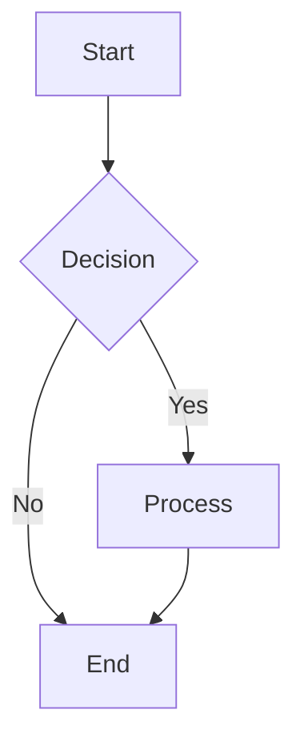
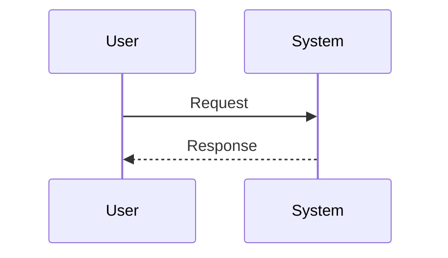
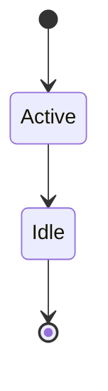

# Quick Start: Accessing the Documentation

## 📍 You Are Here

The documentation has been created and is ready to use! Here's how to access it:

## 🚀 Three Ways to Access

### 1. On GitHub (Easiest)
Just click these links:
- **[Documentation Overview](docs/README.md)** - Start here to learn about the system
- **[Algorithm Template](docs/algorithms/README.md)** - Use this to create new docs
- **[Tile Spawning Example](docs/algorithms/TileSpawning.md)** - See a complete example

The Mermaid diagrams will render automatically when you view the files on GitHub!

### 2. Browse the Folder
Navigate to the `docs/` folder in this repository:
```
docs/
├── README.md                  ← Main documentation guide
└── algorithms/
    ├── README.md             ← Template with examples
    └── TileSpawning.md       ← Complete algorithm example
```

### 3. Clone Locally
```bash
# Clone the repository
git clone https://github.com/oliveeah/Production-Project-2.git
cd Production-Project-2

# View documentation files
cd docs
ls -la

# Open in your favorite markdown viewer
# Recommended: VS Code with "Markdown Preview Mermaid Support" extension
```

## 📊 What's Inside

### Main Documentation Guide ([docs/README.md](docs/README.md))
- Introduction to algorithm documentation
- 5 Mermaid diagram types explained
- Quick reference for syntax
- How to edit diagrams
- Best practices

**Contains:** 5 working Mermaid examples, 201 lines

### Algorithm Template ([docs/algorithms/README.md](docs/algorithms/README.md))
- Complete template structure
- 7 Mermaid diagram examples
- Step-by-step usage instructions
- Tips for each diagram type

**Contains:** 7 working Mermaid examples, 293 lines

### Example: Tile Spawning ([docs/algorithms/TileSpawning.md](docs/algorithms/TileSpawning.md))
- Real algorithm from the codebase
- Time complexity: O(n×m)
- Space complexity: O(n×m)
- 5 professional diagrams
- Complete pseudocode
- Edge cases documented

**Contains:** 5 working Mermaid diagrams, 427 lines

## 🎨 Viewing the Diagrams

### On GitHub
Just open any `.md` file - diagrams render automatically! ✨

### Locally
**Option 1: VS Code**
1. Install "Markdown Preview Mermaid Support" extension
2. Open any `.md` file
3. Press `Ctrl+Shift+V` (Windows/Linux) or `Cmd+Shift+V` (Mac)

**Option 2: Online Editor**
1. Copy diagram code from the files
2. Paste into [Mermaid Live Editor](https://mermaid.live)
3. Edit and export as needed

## 📝 Creating Your Own Algorithm Documentation

1. **Copy the template:**
   ```bash
   cp docs/algorithms/README.md docs/algorithms/YourAlgorithm.md
   ```

2. **Fill in your algorithm details:**
   - Algorithm name and purpose
   - Time/space complexity
   - Choose appropriate diagram types
   - Add pseudocode
   - Document edge cases
   - Provide examples

3. **Edit diagrams:**
   - Use [Mermaid Live Editor](https://mermaid.live) for interactive editing
   - Paste the code back into your markdown file

4. **Preview:**
   - Push to GitHub to see rendered diagrams
   - Or use VS Code with Mermaid extension

## 🎯 Quick Examples

### Flowchart (Algorithm Flow)


### Sequence Diagram (Interactions)


### State Diagram (States)


## ❓ Need Help?

- **Documentation guide:** [docs/README.md](docs/README.md)
- **Template with examples:** [docs/algorithms/README.md](docs/algorithms/README.md)
- **Complete example:** [docs/algorithms/TileSpawning.md](docs/algorithms/TileSpawning.md)
- **Mermaid help:** [mermaid.js.org](https://mermaid.js.org/)
- **Live editor:** [mermaid.live](https://mermaid.live)

---

**That's it!** The documentation is ready to use. Start by viewing [docs/README.md](docs/README.md) on GitHub! 🎉
