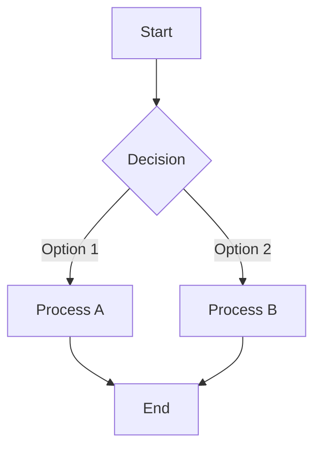
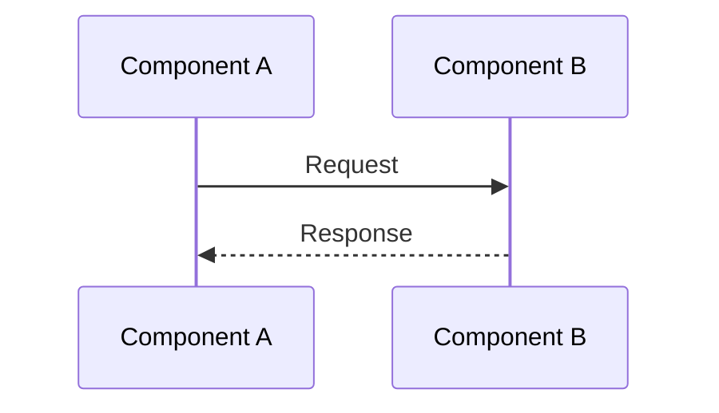
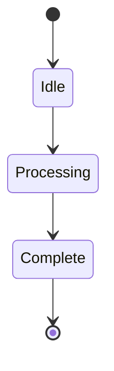
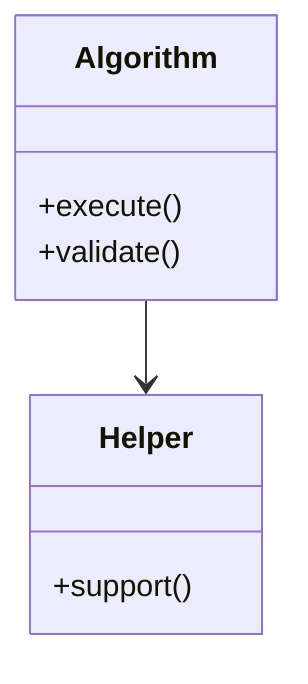
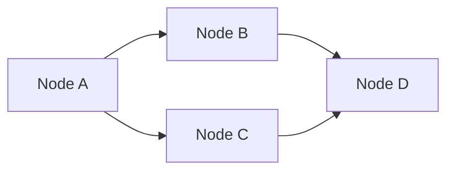

# Algorithm Documentation Guide

Welcome to the algorithm documentation for Production Project 2. This documentation uses [Mermaid](https://mermaid.js.org/) diagrams to provide visual representations of algorithms, data structures, and their interactions.

## 📚 Table of Contents

- [Introduction](#introduction)
- [Mermaid Diagram Types](#mermaid-diagram-types)
- [Quick Reference Guide](#quick-reference-guide)
- [How to Edit Diagrams](#how-to-edit-diagrams)
- [Best Practices](#best-practices)
- [Algorithm Documentation](#algorithm-documentation)

## Introduction

This documentation system provides a structured approach to documenting algorithms used in the Production Project 2 codebase. Each algorithm is documented with:

- **Visual diagrams** using Mermaid for easy understanding
- **Complexity analysis** for performance considerations
- **Pseudocode** for implementation guidance
- **Edge cases** for robust implementation
- **Practical examples** for real-world usage

## Mermaid Diagram Types

Mermaid supports multiple diagram types, each suited for different aspects of algorithm documentation:

### 1. Flowcharts
**Best for:** Algorithm flow, decision trees, process steps

Flowcharts visualize the step-by-step execution flow of an algorithm, including decision points and branches.



### 2. Sequence Diagrams
**Best for:** Component interactions, message passing, API calls

Sequence diagrams show how different components or objects interact over time.



### 3. State Diagrams
**Best for:** State machines, lifecycle management, algorithm phases

State diagrams represent the different states an algorithm or system can be in and the transitions between them.



### 4. Class Diagrams
**Best for:** Object structure, inheritance, dependencies

Class diagrams show the structure of classes and their relationships.



### 5. Graphs
**Best for:** Data structures, networks, relationships

Graphs visualize nodes and their connections, perfect for representing data structures like trees and graphs.



## Quick Reference Guide

### Common Mermaid Syntax Patterns

#### Flowchart Shapes
```
[Rectangle]          - Standard process
(Rounded)           - Start/End
{Diamond}           - Decision
[[Subroutine]]      - Predefined process
[(Database)]        - Data storage
```

#### Arrow Types
```
-->     Solid arrow
-.->    Dotted arrow
==>     Thick arrow
-->>    Async message (sequence diagrams)
```

#### Styling
```
classDef className fill:#f9f,stroke:#333,stroke-width:2px
class nodeId className
```

## How to Edit Diagrams

### Live Editor
Use the [Mermaid Live Editor](https://mermaid.live) to:
- Create and edit diagrams interactively
- Preview changes in real-time
- Export diagrams as images or code
- Share diagrams with team members

### In GitHub
1. Edit the markdown file directly in GitHub
2. Diagrams render automatically in:
   - README files
   - Pull request descriptions
   - Issue comments
   - Wiki pages

### Local Editing
1. Edit markdown files in your preferred editor
2. Use VS Code with the "Markdown Preview Mermaid Support" extension
3. Preview changes before committing

## Best Practices

### 1. Keep It Simple
- Use the simplest diagram type that conveys your message
- Avoid overcrowding diagrams with too many nodes
- Break complex algorithms into multiple diagrams

### 2. Be Consistent
- Use consistent naming conventions
- Maintain similar styling across diagrams
- Follow the same structure for all algorithm documentation

### 3. Focus on Clarity
- Add descriptive labels to nodes and edges
- Use colors sparingly and meaningfully
- Include legends when using special symbols

### 4. Update Regularly
- Keep diagrams in sync with code changes
- Review diagrams during code reviews
- Archive outdated documentation

### 5. Provide Context
- Explain what the diagram shows
- Link diagrams to related code
- Add notes for complex sections

## Algorithm Documentation

### Available Documentation

- [Algorithm Template](algorithms/README.md) - Template and examples for documenting algorithms
- [Tile Spawning Algorithm](algorithms/TileSpawning.md) - Example: Procedural tile generation algorithm

### Creating New Documentation

When documenting a new algorithm:

1. Copy the [template](algorithms/README.md)
2. Fill in all sections with algorithm-specific information
3. Choose appropriate Mermaid diagram types
4. Include complexity analysis
5. Add practical examples
6. Document edge cases and limitations

## Additional Resources

- [Official Mermaid Documentation](https://mermaid.js.org/)
- [Mermaid Live Editor](https://mermaid.live)
- [Mermaid GitHub Repository](https://github.com/mermaid-js/mermaid)
- [GitHub Flavored Markdown](https://guides.github.com/features/mastering-markdown/)

---

**Note:** All diagrams in this documentation render natively in GitHub. No additional tools or plugins are required to view them.
