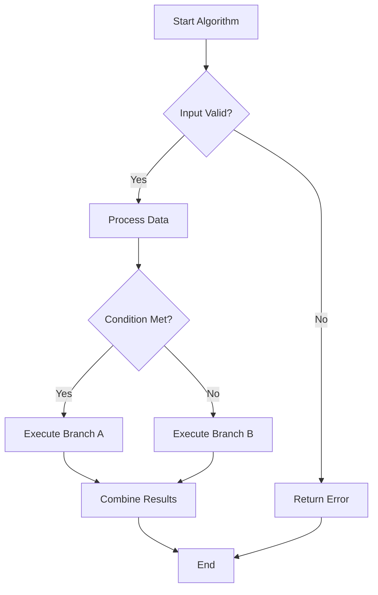
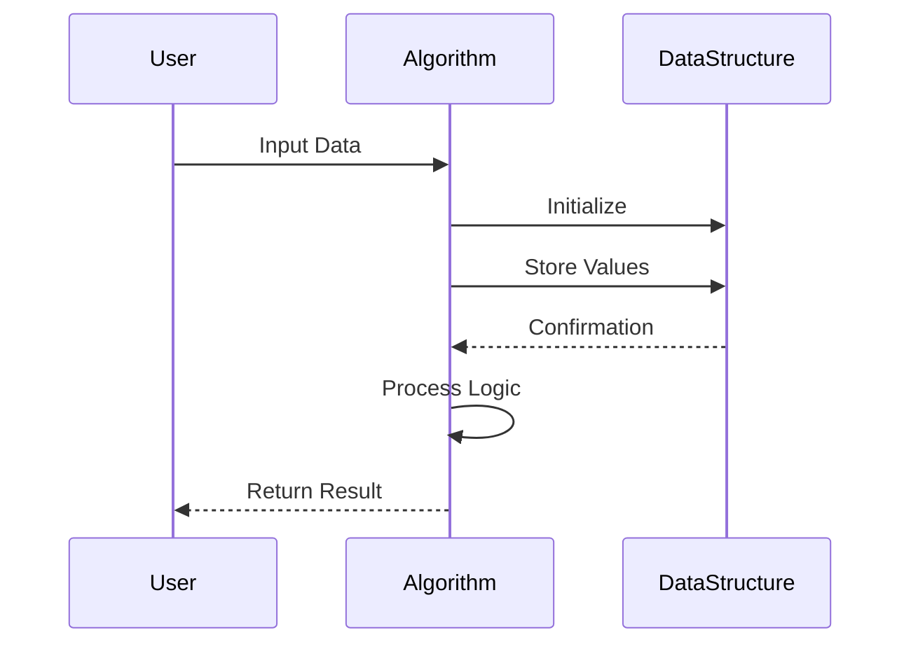
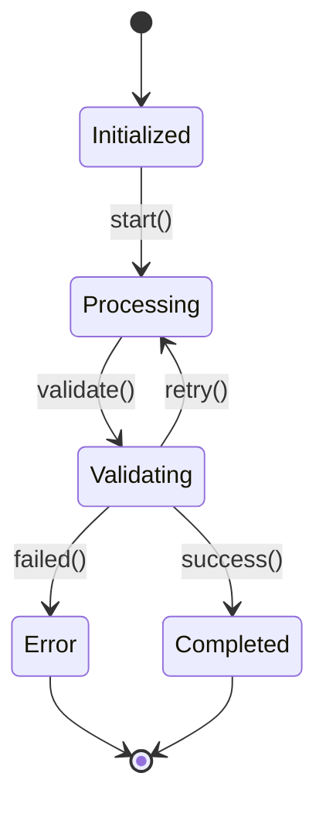
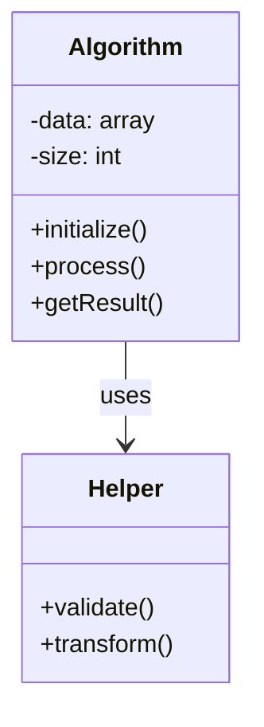
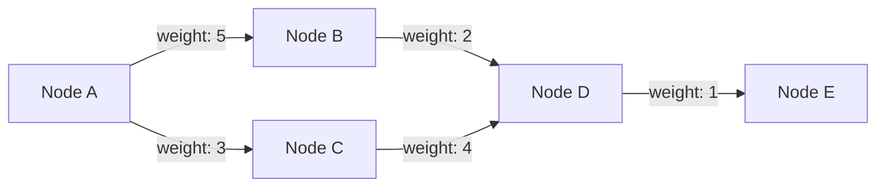
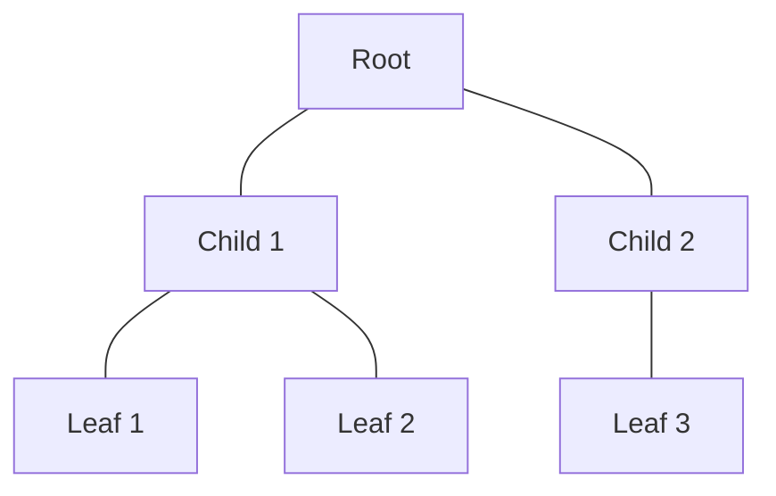
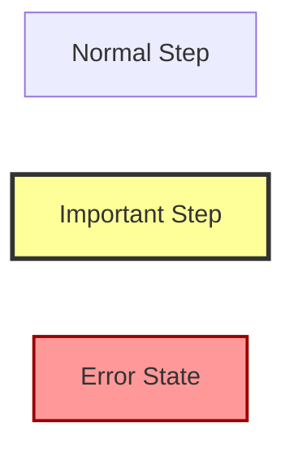

# Algorithm Documentation Template

This file serves as a template for documenting algorithms in the Production Project 2 codebase. It includes examples of all major Mermaid diagram types that are useful for algorithm documentation.

## Table of Contents

- [Template Structure](#template-structure)
- [Mermaid Diagram Examples](#mermaid-diagram-examples)
  - [Flowchart Example](#flowchart-example)
  - [Sequence Diagram Example](#sequence-diagram-example)
  - [State Diagram Example](#state-diagram-example)
  - [Class Diagram Example](#class-diagram-example)
  - [Graph/Directed Graph Example](#graphdirected-graph-example)
- [How to Use This Template](#how-to-use-this-template)

---

## Template Structure

When documenting an algorithm, include the following sections:

### Algorithm Name & Purpose
```
# [Algorithm Name]

Brief description of what the algorithm does and its primary use case.
```

### Time Complexity
```
**Time Complexity:** O(?)
- Best case: O(?)
- Average case: O(?)
- Worst case: O(?)
```

### Space Complexity
```
**Space Complexity:** O(?)
- Auxiliary space: O(?)
```

### Visual Diagram
Include the main algorithm flow using the most appropriate Mermaid diagram type.

### Pseudocode
```
Algorithm Name(input):
    Step 1: Initialize variables
    Step 2: Process input
    Step 3: Return result
```

### Edge Cases
- Edge case 1: Description and handling
- Edge case 2: Description and handling
- Edge case 3: Description and handling

### Example Usage
Provide practical examples showing how the algorithm is used in the codebase.

---

## Mermaid Diagram Examples

Below are examples of different Mermaid diagram types. Choose the most appropriate type(s) for your algorithm documentation.

### Flowchart Example

**Purpose:** Visualize algorithm flow, decision points, and execution paths.

**When to use:** For step-by-step algorithm logic, control flow, and branching decisions.



**Key Features:**
- Clear start and end points
- Decision diamonds for branching logic
- Process rectangles for operations
- Directional flow with labeled edges

---

### Sequence Diagram Example

**Purpose:** Show interactions between different components, objects, or actors over time.

**When to use:** For documenting component interactions, API calls, message passing, and temporal relationships.



**Key Features:**
- Participants represent different actors/components
- Solid arrows (->>) for synchronous calls
- Dashed arrows (-->>) for responses
- Self-referencing arrows for internal processing

---

### State Diagram Example

**Purpose:** Represent different states and transitions in an algorithm or system.

**When to use:** For state machines, lifecycle management, and algorithms with distinct phases.



**Key Features:**
- States represent different phases
- Transitions show triggers/conditions
- Start ([*]) and end states
- Loops for retry logic

---

### Class Diagram Example

**Purpose:** Show the structure of classes, their attributes, methods, and relationships.

**When to use:** For object-oriented algorithms, data structures, and architectural patterns.



**Key Features:**
- Class boxes with name, attributes, and methods
- Visibility indicators (+ public, - private, # protected)
- Relationships (association, inheritance, composition)
- Type annotations for attributes

---

### Graph/Directed Graph Example

**Purpose:** Visualize data structures, networks, and relationships between nodes.

**When to use:** For trees, graphs, networks, dependencies, and hierarchical structures.



**Key Features:**
- Nodes represent data elements
- Edges show relationships/connections
- Edge labels for weights or descriptions
- Directional flow (LR, TD, RL, BT)

**Alternative: Undirected Graph**


---

## How to Use This Template

### Step 1: Copy the Structure
Copy the template structure sections above into a new markdown file named after your algorithm (e.g., `BubbleSort.md`, `BinarySearch.md`).

### Step 2: Fill in Algorithm Details
- **Name & Purpose:** Clearly state what the algorithm does
- **Complexity Analysis:** Provide Big-O notation for time and space
- **Pseudocode:** Write clear, language-agnostic steps

### Step 3: Choose Appropriate Diagrams
Select 1-3 diagram types that best represent your algorithm:
- **Simple algorithms:** Usually need just a flowchart
- **Component interactions:** Add a sequence diagram
- **Stateful algorithms:** Include a state diagram
- **Object-oriented:** Add a class diagram
- **Graph/tree algorithms:** Include a graph visualization

### Step 4: Document Edge Cases
Think about:
- Empty input
- Single element
- Maximum size limits
- Invalid input
- Boundary conditions
- Error states

### Step 5: Provide Examples
Include:
- Code snippets from the actual implementation
- Input/output examples
- Visual demonstrations
- Performance benchmarks (if applicable)

### Step 6: Review and Update
- Verify diagrams render correctly on GitHub
- Test with the [Mermaid Live Editor](https://mermaid.live)
- Keep documentation in sync with code changes
- Update during code reviews

---

## Example Algorithm Documentation

For a complete example of algorithm documentation following this template, see:
- [Tile Spawning Algorithm](TileSpawning.md)

---

## Additional Tips

### Combining Diagram Types
For complex algorithms, you may need multiple diagram types:
1. **Flowchart** for the main algorithm flow
2. **Sequence diagram** for component interactions
3. **State diagram** for algorithm phases
4. **Class diagram** for data structure organization

### Diagram Complexity
- Keep diagrams simple and focused
- If a diagram becomes too complex, split it into multiple diagrams
- Use subgraphs to group related nodes
- Add comments to explain non-obvious logic

### Styling Guidelines


---

**Remember:** Good documentation is clear, concise, and maintainable. Focus on helping other developers understand the algorithm quickly and accurately.
