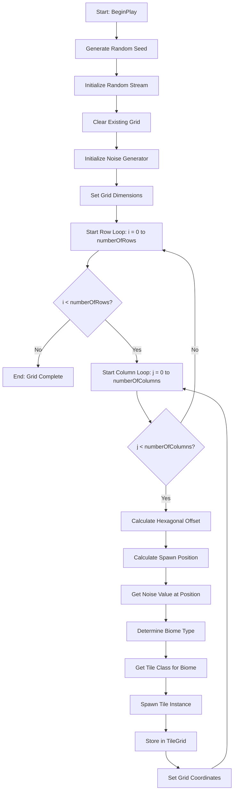
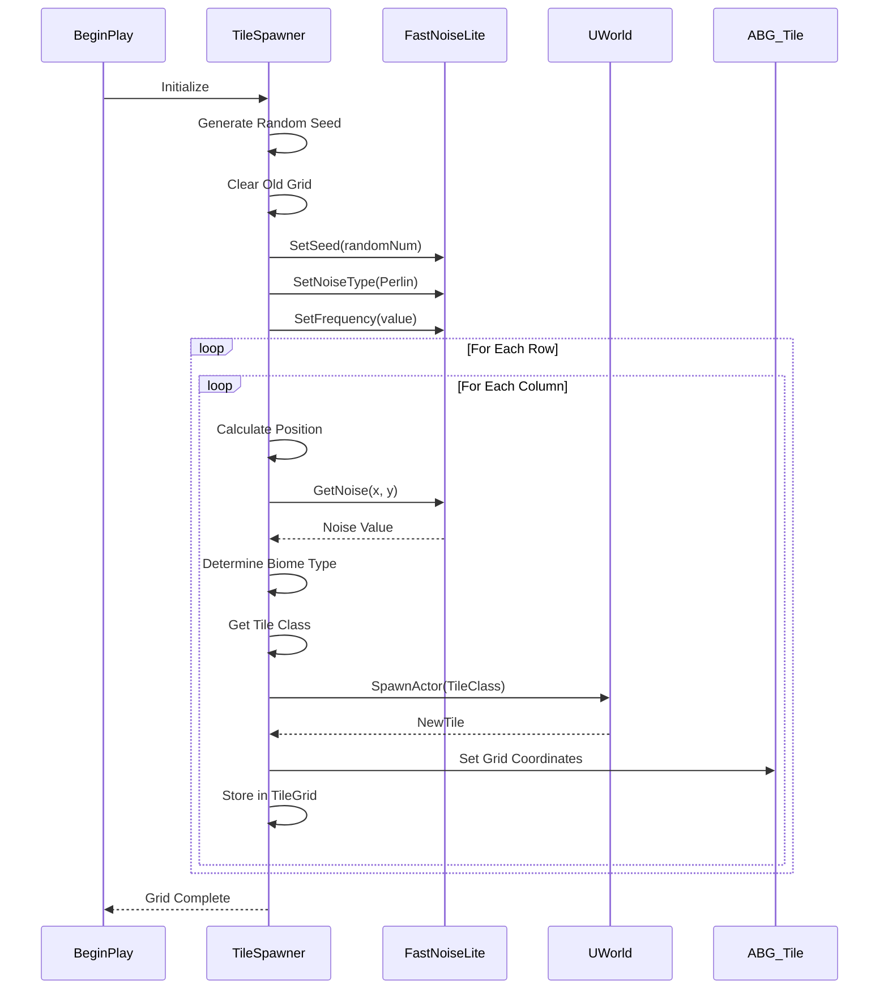
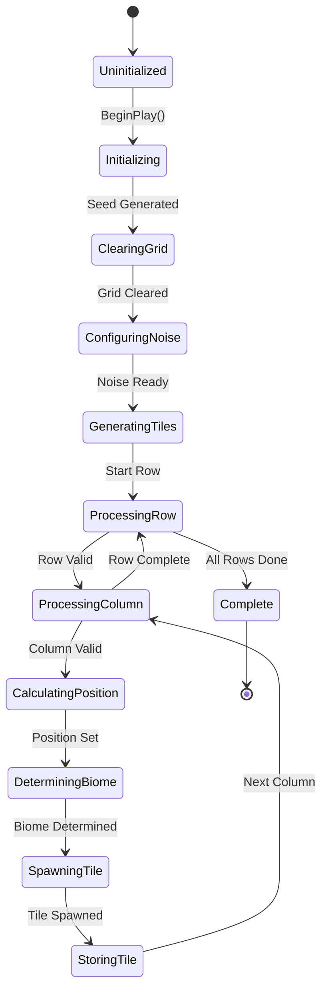
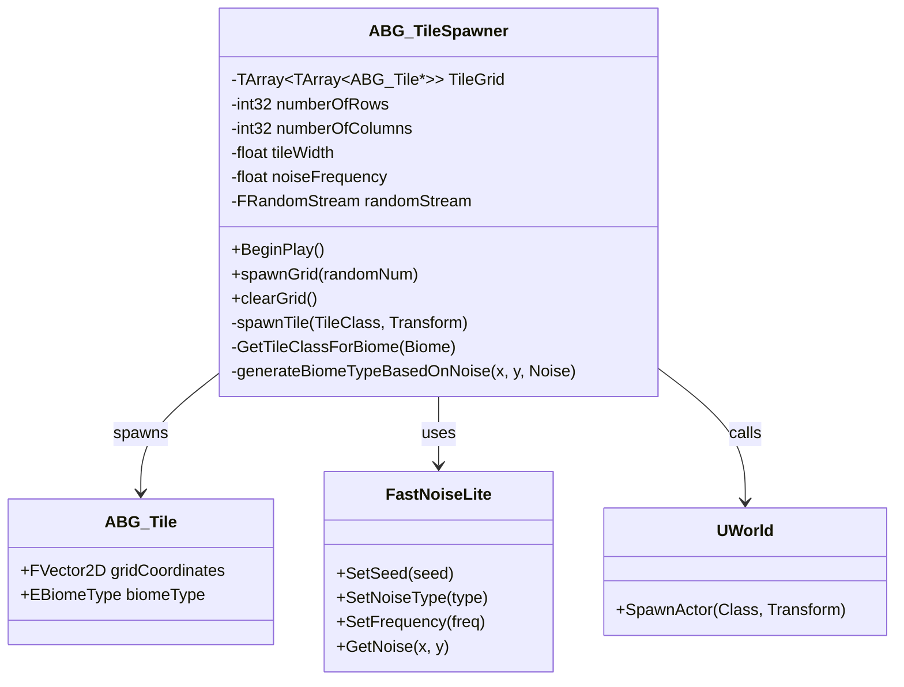
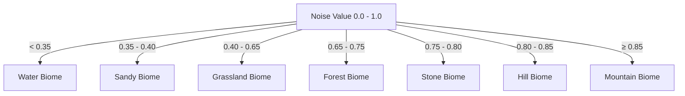

# Tile Spawning Algorithm

A procedural tile generation algorithm that creates a hexagonal grid-based terrain system using Perlin noise for biome distribution. This algorithm is used in Production Project 2 to generate game worlds with varied terrain types.

## Algorithm Overview

The Tile Spawning algorithm generates a 2D hexagonal grid where each tile's biome type is determined by Perlin noise values. The algorithm ensures smooth terrain transitions and realistic biome distribution patterns.

**Primary Use Case:** Procedural world generation for grid-based games

**Key Features:**
- Hexagonal grid layout with proper offset handling
- Perlin noise-based biome generation
- Support for 7 different biome types
- Deterministic generation with seed support
- Efficient 2D array storage

---

## Time Complexity

**Time Complexity:** O(n × m)
- **Best case:** O(n × m) - Must generate all tiles
- **Average case:** O(n × m) - Linear with grid size
- **Worst case:** O(n × m) - No variation

Where:
- `n` = number of rows (numberOfRows)
- `m` = number of columns (numberOfColumns)

**Justification:** The algorithm must iterate through every cell in the grid exactly once to spawn each tile, making it inherently O(n × m).

---

## Space Complexity

**Space Complexity:** O(n × m)
- **Grid storage:** O(n × m) - TileGrid stores pointers to all tiles
- **Auxiliary space:** O(1) - Constant additional variables

The algorithm stores a 2D array of tile references, resulting in linear space complexity relative to grid dimensions.

---

## Visual Diagram: Main Algorithm Flow



---

## Sequence Diagram: Component Interactions



---

## State Diagram: Algorithm Phases



---

## Class Diagram: Algorithm Structure



---

## Biome Distribution Graph



---

## Pseudocode

```
Algorithm TileSpawning(numberOfRows, numberOfColumns, tileWidth, noiseFrequency):
    // Initialization Phase
    randomSeed = GenerateRandomNumber()
    randomStream.Initialize(randomSeed)
    ClearExistingGrid()
    
    // Noise Configuration
    noise = new FastNoiseLite()
    noise.SetSeed(randomSeed)
    noise.SetNoiseType(PERLIN)
    noise.SetFrequency(noiseFrequency)
    
    // Grid Dimensions
    hexWidth = tileWidth
    hexHeight = hexWidth * 0.866  // Hexagonal height factor
    
    TileGrid.SetSize(numberOfRows, numberOfColumns)
    
    // Main Generation Loop
    for row from 0 to numberOfRows - 1:
        for col from 0 to numberOfColumns - 1:
            // Calculate hexagonal offset
            if row is even:
                xOffset = 0
            else:
                xOffset = hexWidth * 0.5
            
            // Calculate spawn position
            spawnX = col * hexWidth + xOffset
            spawnY = row * hexHeight
            spawnPosition = (spawnX, spawnY, 0)
            
            // Determine biome using noise
            noiseX = col + (row % 2) * 0.5
            noiseY = row * 0.8660254
            noiseValue = (noise.GetNoise(noiseX, noiseY) + 1) * 0.5
            
            biomeType = DetermineBiomeFromNoise(noiseValue)
            tileClass = GetTileClassForBiome(biomeType)
            
            // Spawn and store tile
            newTile = SpawnTile(tileClass, spawnPosition)
            TileGrid[row][col] = newTile
            newTile.gridCoordinates = (row, col)
    
    return TileGrid

Function DetermineBiomeFromNoise(value):
    if value < 0.35: return WATER
    if value < 0.40: return SANDY
    if value < 0.65: return GRASSLAND
    if value < 0.75: return FOREST
    if value < 0.80: return STONE
    if value < 0.85: return HILL
    return MOUNTAIN
```

---

## Edge Cases

### 1. Invalid World Context
**Condition:** `GetWorld()` returns `nullptr`
**Handling:** Early return from `spawnGrid()` to prevent crashes
**Impact:** Grid generation fails gracefully

### 2. Missing Tile Class
**Condition:** Specific biome tile class is not assigned
**Handling:** `GetTileClassForBiome()` returns base `TileClass` as fallback
**Impact:** Uses default tile appearance instead of biome-specific tile

### 3. Zero Grid Dimensions
**Condition:** `numberOfRows` or `numberOfColumns` is 0
**Handling:** Loop conditions prevent execution
**Impact:** Empty grid is created without errors

### 4. Extremely Large Grids
**Condition:** Very large row/column counts (e.g., 10000×10000)
**Handling:** No built-in limit
**Impact:** May cause performance issues or memory exhaustion
**Recommendation:** Add validation for maximum grid size

### 5. Pending Kill Tiles
**Condition:** Tiles in grid are marked for deletion
**Handling:** `clearGrid()` checks `IsPendingKillPending()` before destroying
**Impact:** Prevents double-deletion crashes

### 6. Hexagonal Offset Calculation
**Condition:** Odd-numbered rows need horizontal offset
**Handling:** `(rows % 2 == 0)` check applies proper offset
**Impact:** Ensures proper hexagonal grid alignment

---

## Example Usage

### Basic Grid Generation

```cpp
// In Blueprint or C++
ABG_TileSpawner* TileSpawner = GetWorld()->SpawnActor<ABG_TileSpawner>();

// Configure parameters (typically set in Blueprint)
TileSpawner->numberOfRows = 50;
TileSpawner->numberOfColumns = 50;
TileSpawner->tileWidth = 100.0f;
TileSpawner->noiseFrequency = 0.05f;

// Grid automatically spawns in BeginPlay()
```

### Accessing Generated Tiles

```cpp
// Get tile at specific coordinates
if (TileSpawner && TileGrid.IsValidIndex(row) && TileGrid[row].IsValidIndex(col))
{
    ABG_Tile* Tile = TileGrid[row][col];
    if (Tile)
    {
        // Use tile
        UE_LOG(LogTemp, Display, TEXT("Tile at (%d, %d): %s"), 
               row, col, *Tile->GetName());
    }
}
```

### Custom Seed for Reproducibility

```cpp
// Modify BeginPlay() to use custom seed
void ABG_TileSpawner::BeginPlay()
{
    Super::BeginPlay();
    
    const float customSeed = 12345.0f;  // Use specific seed
    randomStream.Initialize(customSeed);
    
    clearGrid();
    spawnGrid(customSeed);
}
```

---

## Performance Characteristics

### Grid Size Impact

| Grid Size | Total Tiles | Expected Time* | Memory Usage** |
|-----------|-------------|----------------|----------------|
| 10×10     | 100         | <1ms           | ~800 bytes     |
| 50×50     | 2,500       | ~25ms          | ~20 KB         |
| 100×100   | 10,000      | ~100ms         | ~80 KB         |
| 500×500   | 250,000     | ~2.5s          | ~2 MB          |

*Approximate times on modern hardware
**Pointer storage only; actual tile objects require additional memory

### Optimization Considerations

1. **Noise Calculation:** Most expensive operation per tile
2. **Actor Spawning:** Second most expensive (Unreal Engine overhead)
3. **Array Access:** Minimal overhead with pre-sized arrays

---

## Related Algorithms

- **Perlin Noise Generation** - Used for biome distribution
- **Hexagonal Grid Math** - Coordinate calculation and offset
- **Actor Pooling** - Could optimize spawn/destroy cycles

---

## Implementation Notes

### Hexagonal Grid Mathematics

The algorithm uses offset coordinates for hexagonal grids:
- **Even rows:** No horizontal offset
- **Odd rows:** Offset by half tile width (hexWidth * 0.5)
- **Vertical spacing:** Uses factor 0.866 (≈ √3/2) for proper hexagon alignment

### Noise Normalization

Perlin noise returns values in range [-1, 1]. The algorithm normalizes to [0, 1]:
```cpp
float Value = (_Noise.GetNoise(Nx, Ny) + 1.f) * 0.5f;
```

This enables direct threshold comparison for biome determination.

### Biome Thresholds

Biome distribution is carefully balanced:
- **Water (35%):** Large areas for oceans/lakes
- **Sandy (5%):** Beaches/desert edges
- **Grassland (25%):** Main terrain type
- **Forest (10%):** Moderate coverage
- **Stone (5%):** Rocky areas
- **Hill (5%):** Elevated terrain
- **Mountain (15%):** High peaks

---

## Future Enhancements

1. **Multi-octave Noise:** Layer multiple noise frequencies for more detail
2. **Biome Blending:** Smooth transitions between biomes
3. **Height Maps:** Add elevation data to tiles
4. **Object Pooling:** Reuse tiles instead of destroying/spawning
5. **Chunk-based Loading:** Generate grid in chunks for larger worlds
6. **Custom Seeds UI:** Allow players to input seeds for reproducible worlds

---

## References

- **FastNoiseLite:** [GitHub Repository](https://github.com/Auburn/FastNoiseLite)
- **Hexagonal Grids:** [Red Blob Games Guide](https://www.redblobgames.com/grids/hexagons/)
- **Perlin Noise:** [Wikipedia Article](https://en.wikipedia.org/wiki/Perlin_noise)

---

**Last Updated:** 2026-02-10  
**Source Files:** 
- `/Source/ProductionProjCurr/Public/tileSpawningLogic/BG_TileSpawner.h`
- `/Source/ProductionProjCurr/Public/tileSpawningLogic/BG_TileSpawner.cpp`
